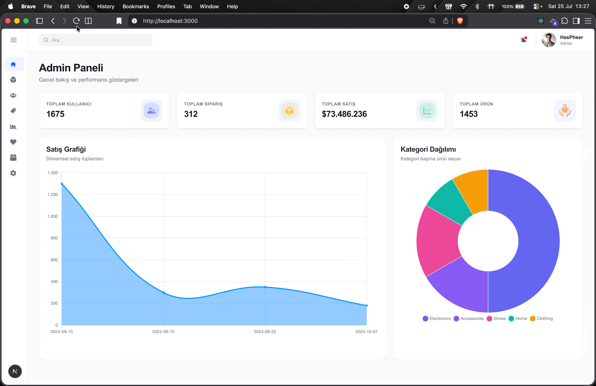

# 🛒 Admin Dashboard


A modern, fast, and user-friendly **Admin Dashboard** built with **Next.js 16**. The application provides a centralized interface for managing essential e-commerce operations, including products, users, and orders. It features an intuitive UI, responsive design, interactive charts, and efficient data management.

---

## ✨ Features

- 📊 **Dashboard**
  - Overview cards displaying total users, orders, products, and revenue.
  - Interactive sales line chart.
  - Category distribution doughnut chart.

- 📦 **Product Management**
  - List all products.
  - View product details.
  - Create new products.
  - Update existing products.
  - Delete products (CRUD operations).

- 👥 **User Management**
  - Display all registered users.
  - View user details inside a modal.
  - Ban users.

- 📋 **Order Management**
  - View all orders.
  - Track order statuses:
    - Preparing
    - Shipped
    - Delivered

- 🔍 **Modal Components**
  - User detail modal for a better user experience.

- 🎨 **Modern UI**
  - Clean and responsive interface built with Tailwind CSS v4.

- ⚡ **Server Actions**
  - Form handling and navigation using Next.js Server Actions.

- 🔔 **Toast Notifications**
  - Instant feedback using React Toastify.

- 📱 **Responsive Design**
  - Fully optimized for desktop, tablet, and mobile devices.

---

# 🛠 Tech Stack

| Technology                     | Description                                        |
| ------------------------------ | -------------------------------------------------- |
| **Next.js 16**                 | React framework with App Router and Server Actions |
| **React 19**                   | UI library                                         |
| **TypeScript**                 | Static type checking                               |
| **Tailwind CSS v4**            | Utility-first CSS framework                        |
| **Axios**                      | Promise-based HTTP client                          |
| **JSON Server**                | Mock REST API                                      |
| **Chart.js + react-chartjs-2** | Data visualization                                 |
| **React Icons**                | Icon library                                       |
| **React Toastify**             | Toast notifications                                |

---

# 🚀 Getting Started

## Prerequisites

- Node.js **18+**
- npm, yarn, or pnpm

---

## Installation

```bash
# Clone the repository
git clone https://github.com/your-username/admin-dashboard.git

# Navigate to the project
cd admin-dashboard

# Install dependencies
npm install

# Start the mock API
npm run server

# Start the development server
npm run dev
```

Open your browser and visit:

```
http://localhost:3000
```

---

# 📜 Available Scripts

| Command          | Description                           |
| ---------------- | ------------------------------------- |
| `npm run dev`    | Starts the Next.js development server |
| `npm run server` | Starts the JSON Server mock API       |
| `npm run build`  | Builds the application for production |
| `npm run start`  | Runs the production build             |
| `npm run lint`   | Runs ESLint                           |

---

# 📁 Project Structure

```text
src/
├── app/
│   ├── layout.tsx
│   ├── page.tsx
│   ├── loading.tsx
│   ├── error.tsx
│   ├── products/
│   │   ├── page.tsx
│   │   ├── create/page.tsx
│   │   └── edit/[id]/page.tsx
│   ├── users/
│   │   └── page.tsx
│   └── orders/
│       └── page.tsx
│
├── assets/
│   ├── images/
│   └── styles/
│
├── components/
│   ├── button/
│   ├── form/
│   ├── graphs/
│   ├── header/
│   ├── home/
│   ├── modal/
│   ├── products/
│   ├── sidebar/
│   └── table/
│
├── types/
│
└── utils/
    ├── constants.ts
    ├── service.ts
    └── action.ts
```

---

# 🧭 Pages

| Route                 | Description                          |
| --------------------- | ------------------------------------ |
| `/`                   | Dashboard with statistics and charts |
| `/products`           | Product management                   |
| `/products/create`    | Create a new product                 |
| `/products/edit/[id]` | Edit an existing product             |
| `/users`              | User management                      |
| `/orders`             | Order management                     |

---

# 🌟 Highlights

- Modern Admin Dashboard UI
- Full CRUD functionality
- Interactive analytics with Chart.js
- Next.js App Router
- Next.js Server Actions
- Responsive layout
- Reusable component architecture
- Clean and scalable codebase

---

## 🎥 preview


